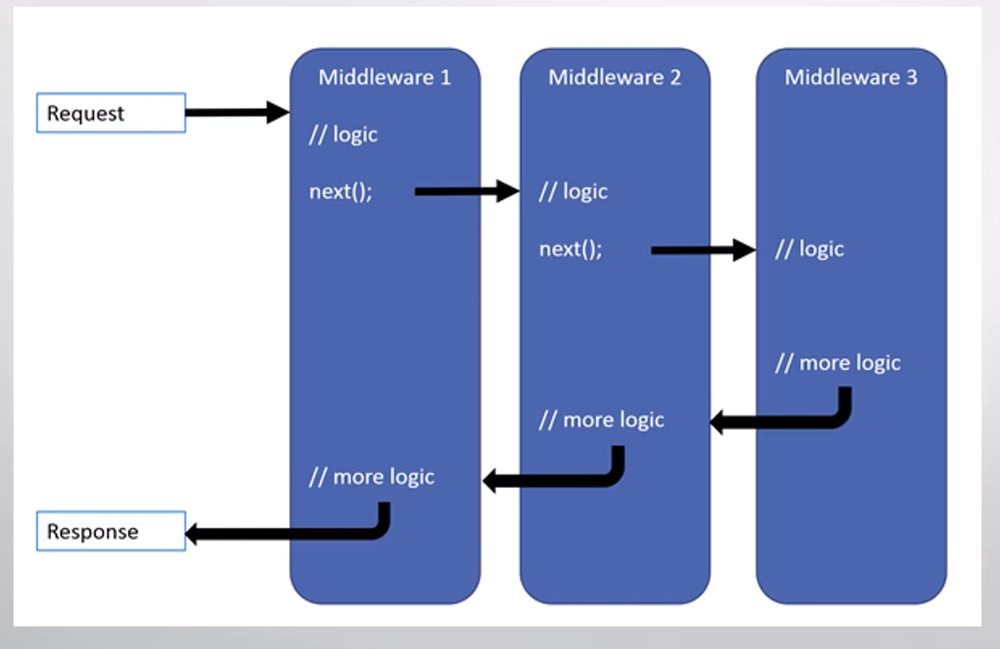

# estudio_ConstruyendoWebAPIsRESTfulASPNET_Udemy_FelipeGavilan

Proyecto que se desarrolla en el curso 'Construyendo Web APIs RESTful con ASP.NET Core 9' impartido por Felipe Gavilan

# Sección 01: Fundamentos de Web API y HTTP

## 003. ¿Qué es REST? - Principios de REST

### REST (Representational State Transfer - Transferencia de estilo representacional)

Es un estilo de construir servicios web los cuales se adhieren a un conjunto de principios establecidos. La idea es que hay un conjunto de condiciones que un web API debe tener para poder decir que implementa REST. Cuando un web API respeta estas condiciones, a dicho web API le llamamos **RESTful**.

Cuando consumimos un web API, es porque queremos acceder a sus recursos. Un recurso hace referencia a cosas o entidades que pueden ser consumidas, por ejemplo, si tenemos un web API que nos permite trabajar con el sistema de una biblioteca, un recurso que el web API podría exponer es el listado de libros de una biblioteca.

Una idea que se relaciona con REST, es la de utilizar métodos **HTTP** sobre una URL para ejecutar distintas funciones del web API. Por ejemplo, supongamos que tenemos la URL `https://miWebApi.com/api/usuario` y sobre esta hacemos un **HTTP GET**, entonces obtendremos un listado de los usuarios. Pero si hacemos un **HTTP POST** a esta misma URL donde enviamos información de un usuario, entonces ejecutaremos la funcionalidad de crear un usuario en el servidor, a esto se le llama _HTTP CRUD_.

Realizar un _HTTP CRUD_ no es suficiente para decir que un API es RESTful. Para que nuestra API sea considerada RESTful, deben respetarse ciertas condiciones. La ventaja de respetar esas condiciones es que, en general, tenemos beneficios añadidos, como un _software_ que puede desarrollarse y responder a cambios de requerimientos de negocio de una manera eficiente.

Es importante destacar que no todas las web API tiene que ser RESTful, al final, REST es solo una guía para desarrollar APIs, la cual no se tiene que seguir al pie de la letra para que un API sea buena.

Para que un API sea _RESTful_, debe respetar las 6 condiciones de REST:

1.  **Arquitectura Cliente-Servidor**: la arquitectura cliente servidor nos habla de la separación entre un cliente y un proveedor o servidor. En el caso de los web APIs, el servidor es un servidor web, el cliente puede ser cualquier _software_ capaz de comunicarse utilizando _HTTP_ con el servidor web, por ejemplo, una aplicación web, móvil o de escritorio. Con este principio, aseguramos la separación de responsabilidades entre nuestro servicio de web API y los clientes que consumen dicho servicio. Esto permite la evolución independiente de nuestro web API sin afectar a clientes existentes.
2.  **Interfaz Uniforme**: la idea de la interfaz uniforme, es tener una forma estandarizada de transmisión de información. Con esta condición, tenemos una manera "universal" de utilizar web APIs comunes. La idea es que si se sabe consumir un web API, se sabe consumir cualquier web API sin mucha dificultad. Esta condición nos pide cuatro subcondiciones:
    1.  **Identificación de recurso**: utilizamos URLs para identificar recursos, por ejemplo, https://miApi.com/api/libros
    2.  **Manipulación de recursos usando representaciones**: la idea aquí es que si el cliente tiene una manera para acceder al recurso (típicamente una URL), entonces con esto ya puede modificar el recurso, en nuestro caso utilizaremos métodos _HTTP_ para esto.
    3.  **Mensajes autodescriptivos**: todos los mensajes son completos, en el sentido de que indican toda la información necesaria para que sean trabajados por el servidor de manera satisfactoria. Cuando hablamos de mensajes, en nuestro caso nos referimos a peticiones _HTTP_ que hacemos al servidor. Algo que un mensaje puede indicar es el formato en el que quiere la información del servidor, para eso podemos utilizar **media types**. Los **media types** (tipos de medios), son identificadores de formato que utilizamos para indicar de que manera queremos que se nos dé la información, por ejemplo, podemos pedir que la información del web API se nos dé en formato _JSON_, _XML_, _pdf_, etc. Es importante destacar que aunque el cliente tiene el poder de pedir la información en el formato que desea, es responsabilidad del servidor poder satisfacer la petición del cliente. Si la petición del cliente no es razonable, el servidor no tiene por qué satisfacerla. Por ejemplo, si el cliente quiere un listado de libros y lo pide en formato _jpg_, esto al no tener sentido el web API no tiene por qué satisfacer dicha demanda, sin embargo, sí es razonable que el cliente pueda solicitarlo en formato _XML_ o _JSON_.
    4.  **HATEOAS** (**hyper media** como motor del estado de la aplicación): esto significa que la información que devuelve el web API cuando hacemos una petición, debe incluir _links_ para poder seguir explorando los demás recursos del web API. Por ejemplo, si pedimos un listado de libros, sería ideal que cada uno de esos libros tenga un _link_ el cual nos permita ver el detalle de cada uno de ellos.
3.  **Protocolos sin Estado**: cada una de las peticiones realizadas al web API tienen toda la información necesaria para que la petición sea resuelta de manera satisfactoria. Si nuestra web API requiere que el cliente esté debidamente autenticado para acceder y manipular un recurso, este debe incluir en cada petición _HTTP_ al servidor, algún tipo de información que lo identifique de manera única.
4.  **Caché**: las respuestas del web API deben de indicar cuándo se deben guardar en caché. Cuando hablamos de caché, nos referimos a que el cliente puede guardar el recurso dado por una URL de manera local, en tal sentido que en subsiguientes peticiones _HTTP_, dicho recurso no tenga que ser pedido al web API, sino que se pueda consumir la versión local. Esto disminuye el tiempo de respuesta que deben esperar los clientes de nuestra aplicación. No todo se debe de guardar en caché, pues esto pone en riesgo a nuestros clientes de trabajar con _data_ desactualizada.
5.  **Sistema de capas**: el servicio del servidor debe tener una arquitectura de capas, donde su evolución sea completamente transparente para el cliente.
6.  **Código en demanda** (opcional en caso de web APIs): el servidor web tiene la opción de enviar código fuente el cual se va a ejecutar en el cliente. Típicamente este código es **JavaScript** (aunque no es obligatorio que lo sea).

## 004. Métodos HTTP

Anteriormente se habló de las condiciones que hace que un web API sea RESTful, una de ellas hablaba de las manipulaciones que podemos hacer a los recursos una vez tengamos su URL. Estas manipulaciones se indican utilizando métodos _HTTP_.

Los métodos HTTP (también conocidos como **verbos HTTP**), son un mecanismo del protocolo HTTP los cuales nos permiten expresar la acción la cual queremos ejercer sobre un recurso.

Por ejemplo, si se tiene un recurso localizado en la URL `https://miApi.com/usuarios`. Si queremos obtener un listado de usuarios, podemos hacer un _HTTP GET_ a esta URL y si queremos insertar un usuario a través de nuestra web API, podemos hacer un _HTTP POST_ a esta misma URL. Como podemos ver, los métodos _HTTP_ nos permiten expresar las acciones que queremos realizar sobre un recurso.

- **HTTP GET**: este se utiliza para pedir datos del servidor.
- **HTTP HEAD**: hace lo mismo que el método GET, sin embargo, no nos trae el cuerpo de la respuesta, sino solamente la cabecera. Recordemos que una respuesta _HTTP_ tiene una cabecera y opcionalmente un cuerpo. La cabecera tiene información como: tipo del contenido, fecha de la última modificación, localidad, estatus, entre otros. Por tanto, la cabecera tiene información acerca del mensaje, pero no el mensaje como tal, mientras que el cuerpo de la respuesta típicamente la información que el usuario solicita.
- **HTTP POST**: sieve para indicar que queremos enviar información al servidor, típicamente a través del cuerpo de la petición _HTTP_.
- **HTTP PUT**: lo utilizamos para realizar una actualización completa de un recurso. Normalmente se utiliza casi de la misma manera que _POST_, con la diferencia de que _POST_ se puede utilizar además para actualizar un recurso ya existente en la base de datos. De acuerdo con la especificación de _HTTP 1.1_, si el recurso al cual se le hace el _HTTP PUT_ no existe, el servidor puede crearlo en vez de actualizarlo, pero en la práctica esto no sucede, en la práctica lo que se hace es que si se tuviera que actualizar un recurso que no existe simplemente se devuelve un _No encontrado_
- **HTTP DELETE**: Sirve para expresar que queremos borrar un recurso determinado.

> A los web APIs que utilizan estos métodos para realizar estas operaciones sobre una base de datos, de manera informal se le llama _HTTP CRUD_. De manera formal, en el modelo de madurez de Richardson este es un web APi nivel 2.

- **HTTP PATCH**: este se utiliza para realizar actualizaciones parciales a un recurso. La ventaja de esta operación es que es relativamente rápida comparada con el _PUT_, sin embargo, típicamente su implementación requiere más trabajo.

## 005. Anatomía de una petición HTTP

Cuando trabajamos con web APIs, la comunicación entre nuestros clientes y nuestro API, se va a realizar utilizando peticiones _HTTP_.

Una petición _HTTP_ es un mensaje que una computadora envía a otra utilizando el protocolo _HTTP_. Esta petición las hace los clientes del API hacia nuestro web API. Cuando nuestro API recibe esta petición la procesa y luego retorna una respuesta llamada **respuesta HTTP**.

Los clientes y nuestro API se van a comunicar utilizando peticiones y respuestas _HTTP_. Estos mensajes tienen una estructura.

### Partes de una Petición HTTP

En general, una petición _HTTP_ se divide en tres partes:

- Una línea de petición
- Un conjunto de campos cabecera
- Un cuerpo, el cual es opcional

#### Línea de Petición

En la línea de petición colocamos el método **HTTP** a utilizar, la **URI** de la petición y el protocolo **HTTP** a utilizar.

> Estructura: **MÉTODO-HTTP** _URI_ **PROTOCOLO-HTTP**

```http
<!-- Ejemplos -->
GET /api/autores HTTP/1.1

POST /test.html HTTP/1.1
```

#### Cabecera de la Petición

La cabecera de la petición es donde se encuentran las cabeceras de la petición.

Las cabeceras son metadatos que se envían en la petición para brindar información sobre la petición. Cada cabecera se especifica con: `nombre: valor-de-cabecera`.

```http
<!-- Ejemplos -->

<!-- La cabecera Host indica el dominio del servidor -->
Host: en.wikipedia.org

Cache-Control: no-cache
```

En la cabecera de la petición puede haber múltiples cabeceras. Por ejemplo:

```http
GET /api/autores HTTP/1.1
Host: en.wikipedia.org
Cache-Control: no-cache
```

Las cabeceras `Host` y `Cache-Control` son cabeceras estándar, que tienen un propósito bien definido. Sin embargo, tenemos libertad de utilizar nuestras propias cabeceras personalizadas. Cuando necesitamos expresar nuestra metadata de nuestra petición, podemos utilizar peticiones personalizadas. Lo único que necesitamos es mandarlas en la cabecera de la petición _HTTP_.

#### Cuerpo de la Petición

El cuerpo de la petición es donde colocamos información adicional que vamos a enviar al servidor. En el cuerpo de la petición tenemos libertad de colocar virtualmente lo que queramos.

```http
<!-- Ejemplos -->
Hola <!-- Se envía un simple texto -->

<!-- Se envía información más compleja -->
{
	"Nombre": "Felipe Gavilán",
	"Edad": 999
}
```

#### Ejemplo Petición Completa

```http
POST /api/autores HTTP/1.1
Host: miWebApi.com
Content-Type: application/json
Cache-Control: no-cache

{
	"Nombre": "Felipe Gavilán",
	"Edad": 999
}
```

> Como se puede observar, una línea en blanco es la separación entre la cabecera y el cuerpo de la petición.

### Respuesta HTTP

Cuando el cliente nos envía una petición _HTTP_, nuestro servidor debe de responder con una respuesta _HTTP_.

La respuesta _HTTP_ también tiene su propia estructura, muy similar a la estructura de la petición. Partes de uan Respuesta _HTTP_:

- Línea de estatus
- Cabecera
- Cuerpo, el cual es opcional

#### Anatomía de una Respuesta HTTP

En la línea de estatus se nos indica el estatus de la petición, es decir, si fue exitosa, si hubo un error, o si se require que tomemos algún tipo de acción.

La cabecera es un conjunto de cabeceras, igual que la cabecera de la petición. El servidor puede enviar tantas cabeceras como desee.

El cuerpo es data que el servidor quiere transmitir

#### Ejemplo de Respuesta HTTP

```http
<!-- Línea de estatus -->
HTTP/1.1 200 OK
<!-- Cabeceras -->
Date: Thu, 03 Jan 2019 23:26:07 GMT
Server: gws
Accept-Ranges: bytes
Content-Length: 68894
Content-Type: text/html; charset=UTF-8

<!-- Un documento html en el cuerpo -->
<!doctype html><html ...
```

## 006. Códigos de Estatus HTTP

Cuando se le hace una petición _HTTP_ a un servidor web, eventualmente recibiremos una respuesta _HTTP_. Entre las informaciones contenidas en la respuesta, se encuentra el código de estatus de la respuesta. El código de estatus es un número que indica el resultado de la operación, estos estatus son números de 3 dígitos más un nombre. El primero de los tres dígitos indica la categoría del estatus. Existen 5 categorías de estatus:

| Código | Categoría          |
| ------ | ------------------ |
| 1XX    | Informacional      |
| 2XX    | Exitoso            |
| 3XX    | Redirección        |
| 4XX    | Error del cliente  |
| 5XX    | Error del servidor |

Además del número de tres dígitos, los códigos de estatus tienen un nombre, por ejemplo, el código de estatus 404, recibe el nombre de **Not Found**.

### 1XX - Respuestas informativas

Cuando enviamos una petición _HTTP_ al servidor, el servidor verifica si va a procesar la solicitud, de ser así, le devuelve una respuesta al cliente de que la petición va a ser procesada y que debe esperar la respuesta final más adelante. Esta es una respuesta provisional y no final.

- `100 Continue` (continuar): esta respuesta quiere decir que la cabecera de la petición ha sido recibida y que el cliente debería de enviar el cuerpo de la petición a continuación (si aplica). Esta es una manera eficiente de intercambio de paquetes, porque da la oportunidad al servidor de denegar una petición _HTTP_ sin tener que recibir y procesar todo el cuerpo de la petición, además desde el punto de vista de la seguridad de la información del usuario, el servidor puede detectar si la conexión va a ser insegura, es decir, utilizando _http_ y no _https_ y puede denegar dicha operación sin que el cliente exponga sus datos enviando el cuerpo de la petición sobre una conexión insegura.
- `101 Switching Protocols` (cambiando protocolos): esta respuesta se da cuando el cliente pide un _upgrade_ (actualización de protocolo) y el servidor está de acuerdo con la demanda. Un ejemplo de esto, es cuando el cliente pide al servidor actualizar la conexión para utilizar _web sockets_.

### 2XX - Exitoso

Esta categoría es para indicar que la petición ha sido exitosa.

- `200 OK`: significa que la operación ha sido exitosa. Por ejemplo, si hacemos una petición `GET` sobre un recurso, un `200 OK` indicaría que el recurso ha sido devuelto en la respuesta. Si intentamos hacer una actualización sobre un recurso utilizando un `PUT`, un `200 OK` indicaría que el recurso ha sido actualizado exitosamente.
- `201 Created` (creado): la petición se ha completado, resultado en la creación de un nuevo recurso. Esta es la respuesta exitosa específica que debemos retornar cuando la petición del usuario resulte en crear un nuevo recurso.
- `202 Accepted` (aceptado): la petición ha sido aceptada para ser procesada, pero el procesamiento no ha terminado. Esto se utiliza principalmente para largos procesos en los cuales el usuario no tiene que esperar un resultado inmediato sino que en el futuro se le va a indicar dicho resultado, por ejemplo, en una página de envío de correos masivos el usuario puede indicar que quiere enviar un correo a 1,000 de sus clientes, esto no necesariamente se va a hacer de una vez, sino que es posible que el servidor reciba la petición, le devuelva un `202 Accepted` y luego en el futuro (quizá en los próximos 5 minutos) es que realiza el envío masivo de correos.
- `204 No Content` (no hay contenido): la petición ha sido realizada con éxito y no se va a retornar un cuerpo en la respuesta. Es decir, en este caso el servidor solo debe enviar la línea de respuesta y la cabecera de la respuesta.

### 3XX - Redirección

Esta categoría de códigos de estatus indica que se necesita que el cliente tome acciones adicionales para completar la petición. En ocasiones, esta acción adicional ocurre de manera automática sin necesidad de la interacción del usuario.

- `301 Moved Permanently` (movido permanentemente): se utiliza para indicar una redirección permanente de la _URL_, esto quiere decir que cualquier _link_ que apunte a esta _URL_ debe ser actualizado por la nueva _URL_ correcta. Dicha _URL_ correcta, la devuelve el servidor en la cabecera `location`.
- `302 Found` (encontrado): indica que el recurso solicitado se encuentra en una diferente _URI_ de manera temporal, dado que la nueva localidad es temporal, se necesita que el cliente siga haciendo la petición a la _URI_ original en el futuro.

### 4XX - Error del Cliente

Esta categoría de código de estatus indica que el cliente ha cometido algún tipo de error a la hora de realizar la petición. La naturaleza del error es determinada por el código de estatus.

- `400 Bad Request` (mala petición): el servidor no puede completar la petición por un error del cliente. Este es un error genérico, lo normal es que en el cuerpo de la respuesta coloquemos una explicación de qué fue lo que salió mal para que el cliente pueda corregirlo e intentar la petición nuevamente. Por ejemplo, si el usuario está llenando un formulario y el campo nombre del formulario es obligatorio y no lo llena y le da enviar lo típico es que el servidor devuelva un `400 Bad Request` y en el cuerpo indique que el campo nombre es requerido.
- `401 Unauthorized` (no autorizado): esto quiere decir que el usuario necesita autenticarse o loguearse en nuestro sistema para poder realizar la acción que intenta realizar.
- `403 Forbidden` (prohibido): este código de estatus se envía cuando a pesar de que el usuario está autenticado, el mismo no tiene permisos suficientes para realizar la acción que ha intentado realizar.
- `404 Not Found`: indica que el recurso solicitado no ha podido ser encontrado.
- `405 Method Not Allowed` (método no permitido): el método utilizado no está disponible para el recurso solicitado.
- `408 Request Timeout`: básicamente significa que a la petición se le acabó el tiempo. El servidor tuvo un timeout procesando la petición. Esto ocurre cuando una operación se toma más tiempo del permitido.

### 5XX - Error del Servidor

Esta categoría indica que el servidor ha fallado en poder satisfacer la petición.

- `500 Internal Server Error` (error interno del servidor): este es un error genérico cuya causa puede ser casi cualquier cosa. Por ejemplo, si el código del API da error porque no se pudo conectar a una base de datos, entonces es probable que un error 500 sea lo que podamos servirle al cliente, dado que no es su culpa que nuestro API haya perdido comunicación con la base de datos.
- `503 Service Unavailable` (servicio no disponible): el servidor no se encuentra disponible en estos momentos. Típicamente esto es algo temporal. Aunque también puede ocurrir porque por ejemplo, la aplicación está dando un error y no sube.

# Sección 04: Fundamentos de ASP.NET Core y Web API

## 041. Controladores y Acciones

La idea fundamental de tener un web API es que tendremos clientes que harán peticiones _HTTP_ a nuestro web API. Estas peticiones se hacen a un conjunto de _URLs_ de nuestro dominio. A estas _URL_ les llamamos rutas de nuestro web API. En estas rutas reside un recurso, un ejemplo de ruta podría ser: `https://miapi.com/autores` (donde `miapi.com` es el dominio y `/autores` indica algún tipo de recurso). Normalmente le llamamos ruta a los segmentos de _URL_ posterior al dominio, sin necesidad de mencionar todo el dominio, es decir, decimos que esta ruta es `/autores`.

Cuando hacemos una petición _HTTP_ a una ruta de nuestro web API, típicamente queremos que se ejecute una función de un controlador. A esta función le llamamos **acción**, aunque también se le puede llamar **endpoint**. Una **acción** (o **endpoint**) es una función de un controlador que se ejecuta en respuesta a una petición _HTTP_ realizada a nuestro web API. Mientras que un **controlador** es una clase que agrupa un conjunto de acciones. Típicamente, un controlador agrupa acciones que se relacionan con un recurso.

### Controladores

- Nomenclatura: Nombre + Controller
- Ejemplo: `AutoresController`
- Los controladores normalmente se colocan en una carpeta llamada `Controllers`

## 043. Reglas de Ruteo

Las reglas de ruteo nos permiten mapear una _URL_ con una acción. Existen dos lugares en ASP.NET Core para realizar las configuraciones de ruteo, que son los controladores (se le llama **ruteo por atributo**) y en la clase Program (típicamente se hace en MVC).

Al definir el atributo `[Route("api/autores")]` en el controlador, todas las acciones "heredan" la ruta establecida. Por lo que para ejecutar una acción se hace hacia `https://midominio.com/api/autores/...`.

### Ignorar la regla de ruteo del controlador

Es posible ignorar la ruta que se le definió al controlador (por ejemplo, se ignorará el `api/autores`) y darle una ruta personalizada a una acción. Para eso, el nombre en la plantilla debe iniciar por `/`. Por ejemplo, en el ejemplo siguiente la ruta para la acción será: `https://midominio.com/listado-de-autores`

`[HttpGet("/listado-de-autores")]`

### Definiendo varias rutas para la misma acción

Es posible definir que una acción responda a varias rutas. Para eso utilizamos tantos nombres se necesiten, por ejemplo:

```cs
[HttpGet("/listado-de-autores")] // https://midominio.com/listado-de-autores
[HttpGet] // https://midominio.com/api/autores
public async Task<IEnumerable<Autor>> Get() {}
```

### Definiendo valores en una plantilla

Es posible definir valores en una plantilla. A estos valores se les llama **parámetros de ruta**. Una acción puede tener más de un parámetro de ruta.

```cs
[HttpGet("{parametro1}/{parametro2}")] // api/autores/valor1/valor2 => parametro2 es obligatorio
public ActionResult Get(string parametro1, string parametro2){}
```

También se puede indicar que `parametro2` es opcional (utilizando el símbolo ?).

```cs
[HttpGet("{parametro1}/{parametro2?}")] // api/autores/valor1/valor2 || api/autores/valor1 => si no se envía en la URL el valor de parametro2 se establecerá como null
public ActionResult Get(string parametro1, string? parametro2)
```

En caso de ser necesario, se les puede dar un valor por defecto (para ello el símbolo ? en "string? parametro2" ya no es necesario)

```cs
[HttpGet("{parametro1}/{parametro2?}")] // api/autores/valor1/valor2 || api/autores/valor1 => parametro2 es opcional, si no se envía en la URL el valor de parametro2 es "Valor por defecto"
public ActionResult Get(string parametro1, string parametro2 = "Valor por defecto") {}
```

## 044. Restricciones de Ruta

Los parámetros de ruta nos permiten definir variables a nivel de la _URL_, esto nos permite mayor libertad a la hora de configurar las rutas de nuestras acciones. También es posible definir tipos de datos a los parámetros de ruta (al cual se le conoce como **restricción de variable de ruta**). Para acceder a una acción específica, el parámetro debe ser del tipo de dato establecido. El nombre del parámetro, los `:` y el tipo de dato no deben incluir espacios.

El tipo de parámetro string no existe para los tipos de variable de ruta, para eso se utiliza 'alpha'. Si no se le coloca un tipo de dato, podremos utilizar un string cualquiera (es decir, se aceptan símbolos, números, letras, etc.)

```cs
[HttpGet("{id:int}")]
public async Task<ActionResult<Autor>> Get(int id) {}

[HttpGet("nombre:alpha")]
public async Task<IEnumerable<Autor>> Get(string nombre) {}
```

## 045. Tipos de Datos de Retorno

Desde una acción se puede retornar lo siguiente:

- Tipo específico
- `ActionResult<T>`
- `ActionResult` o `IActionResult`

### `ActionResult`

`ActionResult` (**Resultado de Acción**) es una clase que representa todos los tipos de dato que se pueden retornar desde una acción. Hay clases derivadas de `ActionResult` las cuales podemos utilizar para indicar que queremos retornar un tipo de dato específico.

Por ejemplo, si tenemos una acción que siempre va a retornar un `CreatedAtRouteResult` (es un tipo de dato que representa que un recurso ha sido creado), podemos indicar que ese va a ser el tipo de dato de retorno de la acción.

En vez de utilizar `ActionResult` como tal, podemos utilizar otras opciones:

- `ActionResult<T>`
- `IActionResult`

### Tipo específico

Lo usamos cuando retornamos un tipo de dato cualquiera (string, objeto complejo, etc.). Por ejemplo:

```cs
[HttpGet]
public async Task<IEnumerable<Autor>> Get() {}
```

El problema con esto es que nuestras acciones pierden versatilidad. Por ejemplo, si tenemos una acción (un método) la cual recibe un `id` y queremos retornar el autor al cual le corresponde el `id` o `404 Not Found` si el autor no existe. Con este tipo de dato de retorno no podemos hacer esto.

### `ActionResult<T>`

Nos permite retornar o un tipo específico o un `ActionResult`, por ejemplo:

```cs
[HttpGet("{id:int}")] // api/autores/id
public async Task<ActionResult<Autor>> Get(int id)
{
	var autor = await context.Autores.Include(x => x.Libros).FirstOrDefaultAsync(x => x.Id == id);

	if(autor is null) return NotFound();

	return autor;
}
```

### `IActionResult`

Es muy parecido a `ActionResult<T>`, solo que `IActionResult` solo permite retornar un `ActionResult`. Si se quiere retornar un tipo específico de una acción que retorne `IActionResult`, debe utilizarse la función `Ok()`, por ejemplo:

```cs
[HttpGet("{parametro1}/{parametro2?}")]
public IActionResult Get(string parametro1, string parametro2 = "valor por defecto")
{
	return Ok(new {parametro1, parametro2});
}
```

> Siempre que sea posible es preferible utilizar `ActionResult<T>` y no `IActionResult` o `ActionResult` en su defecto.

## 046. Programación Asíncrona

Cuando ejecutamos una función asíncrona. nuestro servidor Web se pone a hacer otras tareas mientras la función se ejecuta.

No siempre hay que usar programación asíncrona. Hacer una acción asíncrona, tiene un pequeño costo de rendimiento.

Se recomienda utilizar programación asíncrona cuando realizamos operaciones **I/O** (Input/Output). Las operaciones I/O, son operaciones en la cuales nuestro software se comunica con otros sistemas, por ejemplo, llamados a Web APIs, realzar operaciones con bases de datos, etc.

Para hacer un método asíncrono, debe de marcarse con `async`, esto nos permite utilizar el operador `await`. El operador `await` sirve para realizar una "espera asíncrona", es decir, el sistema no se detiene, sino que podemos indicarle a nuestra aplicación que puede ir realizando otras tareas en las que el sistema externo responde, ya cuando el sistema externo responda, se continúa con la ejecución del método. Es como si al utilizar el método `await` pusiera el pausa solo el método actual que se está ejecutando, pero el resto de la aplicación sigue funcionando con normalidad.

### Tipos de Dato de Retorno

Es importante destacar que cuando utilizamos programación asíncrona no podemos retornar un tipo de dato cualquiera. Debe de utilizarse una de las siguientes cuatro opciones:

- `Task`: se usa cuando tenemos un método asíncrono que no tiene un valor de retorno.
- `Task<T>`: `T` es cualquier valor que queremos retornar.
- `ValueTask`
- `ValueTask<T>`

La palabra **Task** significa _tarea_ y la idea es que un método asíncrono representa una tarea que será ejecutada y en el futuro terminará.

#### `Task<T>`

```cs
public async Task<IEnumerable<Autor>> Get() { }
```

#### `Task`

Es un método que no devuelve nada.

```cs
public async Task CrearAutor(Autor autor)
{
	context.Add(autor);
	await context.SaveChangesAsync();
}
```

#### `ValueTask` y `ValueTask<T>`

Son similares a `Task` y `Task<T>`, pero:

- Son tipos de valor
- Los utilizamos cuando tenemos escenarios en los cuales tenemos métodos los cuales a veces pueden ser síncronos y otras veces pueden ser asíncronos. Son una optimización en determinados escenarios.

## 047. Introducción al Model Binding

El **Model Binding** (_Binding_ de modelos), permite mapear datos de una petición _HTTP_ a parámetros de una acción. Esto cubre todo tipo de parámetros: números, booleanos, arreglos, listas, tipos complejos, etc.

Ya hemos visto cómo enviar información hacia los parámetros de una acción a través de los parámetros de ruta (`[HttpGet("{id:int}")] // api/autores/id`).

Estos valores pueden venir de distintas fuentes, las cuales podemos indicar con atributos:

- `[FromRoute]`: la fuente de datos será de un parámetro de ruta.
- `[FromQuery]`: la información viene de un _query string_: `api/autores/id?llave1=valor1&llave2=valor2`.
- `[FromBody]`: otra fuente para hacer _model binding_ es el cuerpo de la petición _HTTP_.
- `[FromHeader]`: otra fuente de datos que se puede utilizar es la cabecera de la petición. Recordemos que las cabeceras se refieren a metadatos que podemos enviar o recibir en el contexto de una petición _HTTP_.
- `[FromForm]`: nos va a servir para recibir archivos en nuestro Web API.

## 048. Validaciones por Defecto

Para crear validaciones por defecto, se utilizan atributos en el tipo de dato que se reciben en las acciones. Por ejemplo, cuando se crea un `Autor`, obligatoriamente se debe enviar un `Nombre` y para eso se utiliza el atributo `[Required]`.

```cs
using System.ComponentModel.DataAnnotations;

namespace BibliotecaAPI.Entidades
{
  public class Autor
  {
    public int Id { get; set; }
    [Required]
    public required string Nombre { get; set; }
    public List<Libro> Libros { get; set; } = new List<Libro>();
  }
}
```

Supongamos que se envía una petición con un `Nombre` vacío. El API devolverá un `400 Bad Request` y una respuesta conocida como **Problem Details**. El _Problem Details_ es un objeto que representa la respuesta de una petición problemática.

```json
{
  "type": "https://tools.ietf.org/html/rfc9110#section-15.5.1",
  "title": "One or more validation errors occurred.",
  "status": 400,
  "errors": {
    "Nombre": ["The Nombre field is required."]
  },
  "traceId": "00-751f8c9b94a8215faa18575c7e890067-0e493a783b4c4d38-00"
}
```

Para que en el arreglo que representa los distintos errores del campo no aparezca en inglés, se puede personalizar el mensaje de error dentro del atributo. Por ejemplo:

```cs
[Required(ErrorMessage = "El campo Nombre es requerido")]
public required string Nombre { get; set; }
```

En caso de que no se quiera _hardcodear_ el nombre del campo, se puede utilizar un **placeholder** `{0}`, lo que hace es sustituir el valor `{0}` por el nombre del campo:

```cs
[Required(ErrorMessage = "El campo {0} es requerido")]
public required string Nombre { get; set; }
```

## 049. Otras Validaciones Por Defecto

- `[StringLength(10, ErrorMessage = "El campo {0} debe tener {1}")]`: significa **Longitud del string**. Con esto podemos indicar que un campo no puede pasar de los caracteres especificados. El _placeholder_ `{0}` se reemplaza por el nombre del campo y el _placeholder_ `{1}` se reemplaza por el número de caracteres especificados (en este caso es 10).
- `[Range(18, 120, ErrorMessage = "La {0} debe ser mayor o igual que {1} pero menor o igual a {2}")]`: se utiliza para indicar que debe enviarse un valor entre el rango especificado (incluyendo los valores indicados, en este caso 18 y 120 son válidos).
- `[CreditCard]`: solo se encarga de validar que el formato de tarjeta sea correcto.
- `[Url]`: de igual manera, solo se encarga de validar que el string esté en un formato de url válida.

## 050. Validaciones Personalizadas por Atributo

Podemos crear validaciones personalizadas que se puede utilizar como atributos. Esto nos permitirá reutilizar esta validación en diferentes clases.

Para hacer esto es necesario crear una clase nueva. En C# es convención que cuando una clase va a ser utilizada como un atributo, su nombre termine en `Attribute`. Además, para poder utilizar la clase como un atributo de validación se debe heredar de `ValidationAttribute`.

```cs
using System.ComponentModel.DataAnnotations;

namespace BibliotecaAPI.Validaciones
{
  public class PrimeraLetraMayusculaAttribute : ValidationAttribute
  {
    protected override ValidationResult? IsValid(object? value, ValidationContext validationContext)
    {
      // Si el valor es nulo o una cadena vacía, se considera válido (porque esta validación verifica que la primera letra sea mayúscula no tiene por qué verificar si el valor es nulo o no)
      if (value is null || string.IsNullOrEmpty(value.ToString()))
      {
          return ValidationResult.Success;
      }

      var valueString = value.ToString()!;
      var primeraLetra = valueString[0].ToString();

      if(primeraLetra != primeraLetra.ToUpper())
      {
          return new ValidationResult("La primera letra debe ser mayúscula");
      }

      return ValidationResult.Success;
    }
  }
}
```

- El parámetro `value` es cualquier valor que intentemos asignarle al campo al que se le aplica el atributo.

Para utilizar el atributo personalizado, se hace como cualquier otro atributo:

```cs
[PrimeraLetraMayuscula]
public required string Nombre { get; set; }
```

## 051. Validaciones Personalizadas por Modelo

Es posible hacer validaciones personalizadas en la misma clase del modelo. Esto podría ser útil si se tiene una validación que involucra varias propiedades. Para esto, se tiene que implementar el método `Validate` de la interfaz `IValidatableObject`. Este método nos permite devolver un `IEnumerable<ValidationResult>`, lo que quiere decir es que se pueden retornar varios `ValidationResult`, que serían básicamente, varios errores de validación. Si no se retorna ningún error de validación, significa que no hubo errores de validación y por lo tanto, el modelo es válido.

> Las validaciones por modelo solamente se ejecutan posterior a la ejecución de las validaciones por atributo y solamente si son exitosas. Si hay un error de validación por atributo, la validación por modelo no se ejecuta.

```cs
using System.ComponentModel.DataAnnotations;

namespace BibliotecaAPI.Entidades
{
  public class Autor : IValidatableObject
  {
    [Required(ErrorMessage = "El campo {0} es requerido")]
		[StringLength(150, ErrorMessage = "El campo {0} debe tener {1} caracteres o menos")]
    public required string Nombre { get; set; }

    public IEnumerable<ValidationResult> Validate(ValidationContext validationContext)
    {
      if(!string.IsNullOrEmpty(Nombre))
      {
        var primeraLetra = Nombre[0].ToString();
        if (primeraLetra != primeraLetra.ToUpper())
        {
        	yield return new ValidationResult("La primera letra debe ser mayúscula - por modelo", new string[] { nameof(Nombre) });
        }
      }
		}
	}
}
```

> El `yield return` es una característica de C# que se usa para crear métodos iteradores. En lugar de devolver una colección completa (como una `List<ValidationResult>`) de una sola vez, el método va devolviendo elementos uno a uno, bajo demanda.
>
> El método `Validate` debe devolver `IEnumerable<ValidationResult>`. Usando `yield return`, cada vez que se encuentra un error de validación, se “entrega” ese `ValidationResult` sin salir completamente del método. El método conserva su estado y continúa ejecutando las siguientes líneas (si las hubiera) cuando se pide el siguiente elemento.
>
> Ventajas frente a devolver una lista

```cs
// Con lista tradicional
public IEnumerable<ValidationResult> Validate(...)
{
  var resultados = new List<ValidationResult>();
  if (!string.IsNullOrEmpty(Nombre))
  {
    var primeraLetra = Nombre[0].ToString();
    if (primeraLetra != primeraLetra.ToUpper())
    {
        resultados.Add(new ValidationResult(...));
    }
  }
  return resultados;
}
```

> Con `yield return`:
>
> - Código más limpio (sin necesidad de crear una colección auxiliar).
> - Evaluación perezosa (lazy) : los resultados se generan solo cuando se itera sobre ellos.
> - Eficiencia si hay muchas validaciones, porque no se reserva memoria para toda la lista si el consumidor solo necesita los primeros elementos.
>
> Es posible tener múltiples `yield return`:

```cs
//...
public required string Nombre { get; set; }
public int Edad { get; set; }

public IEnumerable<ValidationResult> Validate(ValidationContext validationContext)
{
  if(!string.IsNullOrEmpty(Nombre))
  {
    var primeraLetra = Nombre[0].ToString();
    if (primeraLetra != primeraLetra.ToUpper())
    {
        yield return new ValidationResult("La primera letra debe ser mayúscula - por modelo", new string[] { nameof(Nombre) });
    }
  }
  if(Nombre.Length < 5)
  {
    yield return new ValidationResult($"El {nameof(Nombre)} no debe tener más de 5 caracteres", new string[] { nameof(Nombre) });
  }
  if(Edad < 18)
  {
    yield return new ValidationResult("Debe ser mayor de edad", new[] { nameof(Edad) });
  }
}
//...
```

> Cada `yield return` producirá un `ValidationResult` en la colección final que recibe el validador de ASP.NET Core. Si en este ejemplo se enviara la siguiente información:

```json
{
  "nombre": "nomb",
  "edad": 15
}
```

> El _Problem Details_ se vería de la siguiente manera:

```json
{
  "type": "https://tools.ietf.org/html/rfc9110#section-15.5.1",
  "title": "One or more validation errors occurred.",
  "status": 400,
  "errors": {
    "Edad": ["Debe ser mayor de edad"],
    "Nombre": [
      "La primera letra debe ser mayúscula - por modelo",
      "El Nombre no debe tener más de 5 caracteres"
    ]
  },
  "traceId": "00-9f76fd6a5417c5d0067f8b91e8e4ec6b-09cc3d1e46e1bb60-00"
}
```

> Como puede observarse, `errors` tiene todos los campos que incluye errores y si dichos campos tiene más de un error, se mostrarán en el arreglo específico.
>
> Una limitación importante, es que no puedes poner `yield return` dentro de un bloque `try-catch`. Si necesitas manejar excepciones, debes hacerlo antes o usar un enfoque con lista.
>
> Para mayor información sobre `yield`: https://learn.microsoft.com/es-es/dotnet/csharp/language-reference/statements/yield

## 052. Validando desde el Controlador - Validando Contra la BD

Como vimos anteriormente, en una acción dentro de un controlador se puede tener una validación y en caso de que no se cumpla devolver un `BadRequest("")`. El problema con esto es que esto devuelve solo un `string`, pero en este caso lo que se quiere devolver es un _Problem Details_, como se vio anteriormente que devuelve los errores de validación. Para lograr esto, hay que modificar el **model state** (estado de modelo). El _model state_ nos permite tener un objeto en el cual podemos colocar los errores del cliente en esta petición *HTTP*¨.

```cs
[HttpPost]
public async Task<ActionResult> Post(Libro libro)
{
  var existeAutor = await _context.Autores.AnyAsync(x => x.Id == libro.AutorId);

  if (!existeAutor)
  {
    ModelState.AddModelError(nameof(libro.AutorId), $"El autor de id {libro.AutorId} no existe");
    return ValidationProblem();
		// BadRequest devuelve un string
    //return BadRequest($"El autor de id {libro.AutorId} no existe");
	}

  _context.Add(libro);
  await _context.SaveChangesAsync();
  return Ok();
}
```

Ahora, al ejecutar una petición a la acción, nos debería de mostrar un _Problem Details_ como el siguiente:

```json
{
  "type": "https://tools.ietf.org/html/rfc9110#section-15.5.1",
  "title": "One or more validation errors occurred.",
  "status": 400,
  "errors": {
    "AutorId": ["El autor de id 12345 no existe"]
  },
  "traceId": "00-2f0b6d0d6a62da42dc1b3f9498f8676b-23edfae9f1a2a905-00"
}
```

## 055. Servicios en ASP.NET Core

### Tiempo de Vida de Servicios

- Transient: es el de menor tiempo de vida. Cuando un servicio es marcado como `Transient`, cada vez que se solicite una instancia de dicho servicio, esta instancia será totalmente nueva. Se utiliza cuando no hay estado compartido, es decir, cuando la clase no tiene campos que queramos compartir entre instancias.
- Scoped: es cuando se crea una instancia única por petición _HTTP_, es decir, no importa cuántas veces se solicite el servicio, siempre que sea dentro del mismo contexto _HTTP_, será entregada la misma instancia de la clase, esto es útil cuando queremos preservar estado dentro de la solicitud _HTTP_.
- Singleton: se crea una única instancia del servicio durante la vida de la aplicación, es decir, no importa cuántas veces se solicite el servicio, siempre se entregará la misma instancia, aún sea a usuarios distintos. Esto es útil cuando queremos tener un estado global, como por ejemplo, con una capa de caché.

## 056. Ejemplo de Tiempo de Vida de los Servicios

Para ejemplificar la diferencia entre los tres distintos tiempos de vida de los servicios se crearán tres clases diferentes que lo único que harán será crear un `Guid`:

```cs
// EjemploTiemposDeVida.cs
namespace BibliotecaAPI
{
  public class ServicioTransient
  {
    private readonly Guid _id;

    public ServicioTransient()
    {
      _id = Guid.NewGuid();
    }

    public Guid ObtenerGuid => _id;
  }

  public class ServicioScoped
  {
    private readonly Guid _id;

    public ServicioScoped()
    {
        _id = Guid.NewGuid();
    }

    public Guid ObtenerGuid => _id;
  }

  public class ServicioSingleton
  {
    private readonly Guid _id;

    public ServicioSingleton()
    {
       _id = Guid.NewGuid();
    }

    public Guid ObtenerGuid => _id;
  }
}
```

A continuación se configuran en el área de los servicios:

```cs
// Program.cs
builder.Services.AddTransient<ServicioTransient>();
builder.Services.AddScoped<ServicioScoped>();
builder.Services.AddSingleton<ServicioSingleton>();
```

Finalmente se inyectará dos instancias de `ServicioTransient` y de `ServicioScoped` y solo una de `ServicioSingleton` en un controlador.

```cs
namespace BibliotecaAPI.Controllers
{
  [ApiController]
  [Route("api/valores")]
  public class ValoresController : ControllerBase
  {
    private readonly ServicioTransient transient1;
    private readonly ServicioTransient transient2;
    private readonly ServicioScoped scoped1;
    private readonly ServicioScoped scoped2;
    private readonly ServicioSingleton singleton;

    public ValoresController(
      ServicioTransient transient1,
      ServicioTransient transient2,
      ServicioScoped scoped1,
      ServicioScoped scoped2,
      ServicioSingleton singleton
      )
    {
      this.transient1 = transient1;
      this.transient2 = transient2;
      this.scoped1 = scoped1;
      this.scoped2 = scoped2;
      this.singleton = singleton;
    }

    [HttpGet("servicios-tiempo-de-vida")]
    public IActionResult GetServiciosTiempoDeVida()
    {
      return Ok(new
      {
        Transients = new
        {
          Transient1 = transient1.ObtenerGuid,
          Transient2 = transient2.ObtenerGuid
        },
        Scopeds = new
        {
          Scoped1 = scoped1.ObtenerGuid,
          Scoped2 = scoped2.ObtenerGuid
        },
        Singleton = new
        {
          Singleton = singleton.ObtenerGuid
        }
      });
    }
  }
}
```

Al ejecutar la acción `https://localhost:7156/api/valores/servicios-tiempo-de-vida` nos devolverá el siguiente objeto anónimo:

```json
{
  "transients": {
    "transient1": "c907ba28-38ad-45c2-b847-12343ed9125c",
    "transient2": "110f6b03-714c-4bd8-b3b8-d689e31df372"
  },
  "scopeds": {
    "scoped1": "c305a3ce-9aa2-40eb-93be-7020dba65849",
    "scoped2": "c305a3ce-9aa2-40eb-93be-7020dba65849"
  },
  "singleton": {
    "singleton": "0cd7e53c-6a09-4fad-912c-c434500ae6c3"
  }
}
```

De esta manera logramos confirmar que un servicio `Transient` siempre creará una instancia nueva del servicio. El `Scoped` crea una instancia única por petición _HTTP_. Finalmente, para demostrar que un `Singleton` crea una instancia única durante todo el tiempo de vida de la aplicación, simplemente hay que volver a ejecutar la acción `https://localhost:7156/api/valores/servicios-tiempo-de-vida` y notaremos que no importa cuántas veces se ejecute, siempre va a devolver el valor `0cd7e53c-6a09-4fad-912c-c434500ae6c3`, a menos que se detenga la aplicación y se vuelva a ejecutar, en ese momento sí devolverá un valor completamente diferente y volverá a ser siempre el mismo durante el tiempo de vida de la aplicación.

## 059. Loggers

En _ASP.NET Core_ se puede utilizar un servicio llamado `ILogger`, el cual es un servicio que nos permite centralizar el manejo de los mensajes del logs. Para utilizarlo se inyecta con el sistema de inyección de dependencias y podemos indicarle el nombre de la clase en la cual se va a ejecutar el log `ILogger<AutoresController>`:

```cs
namespace BibliotecaAPI.Controllers
{
  [ApiController]
  [Route("api/autores")]
  public class AutoresController : ControllerBase
  {
    private readonly ApplicationDbContext _context;
    private readonly ILogger<AutoresController> logger;

    public AutoresController(ApplicationDbContext context, ILogger<AutoresController> logger)
    {
      _context = context;
      this.logger = logger;
    }

    [HttpGet]
    public async Task<IEnumerable<Autor>> Get()
    {
      logger.LogInformation("Obteniendo el listado de autores");
      return await _context.Autores.ToListAsync();
    }
  }
}
```

Existen distintos niveles de mensajes:

1. `Critical`
2. `Error`
3. `Warning`
4. `Information`
5. `Debug`
6. `Trace`

La idea es que podamos configurar a partir de qué nivel queremos procesar los mensajes de log. Para realizar esta configuración tendremos que hacerlo en el `appsettings` correspondiente, dentro de la propiedad `Logging`. Sin embargo, cambiar el nivel de mensaje dentro de `Default` llenará la consola con todos los mensajes (dependiendo el nivel configurado). Si solo queremos configurar cierto nivel en un `namespace` en concreto o incluso en una clase de un `namespace`, se puede configurar una **categoría**. Las _categorías_ son el nombre que reciben los _strings_ dentro de `LogLevel`, es decir, los strings como `Default` y `Microsoft.AspNetCore`, que básicamente, son los lugares en los cuales se va a aplicar el nivel de procesamiento de los logs.

En el caso de `Microsoft.AspNetCore`, significa que cualquier clase que se encuentre en ese `namespace` le aplicará el nivel de procesamiento de log indicado (`Warning`). Por ejemplo, si se quiere aplicar el nivel de procesamiento `Trace` al controlador de `Autores`, se haría como se muestra a continuación:

```json
// appsettings.Development.json
"Logging": {
  "LogLevel": {
		"BibliotecaAPI.Controllers.AutoresController": "Trace",
    "Default": "Information",
    "Microsoft.AspNetCore": "Warning"
  }
}
```

La ventaja de hacer esto es que si por ejemplo, estamos investigando un error y necesitamos mostrar todos los mensajes de error en `AutoresController` lo configuramos como `Trace` y una vez que terminemos no necesitamos borrar todos los logs en la clase, sino que podemos subir el nivel de procesamiento o incluso poder `None` para que no se muestre ninguno.

## 060. Introducción al Middleware

Hasta ahora hemos dicho que cuando nuestro _Web API_ recibe una solicitud _HTTP_, es una acción de un controlador la que recibe esta solicitud y la procesa. Esta no es una descripción precisa de lo que sucede cuando se recibe la solicitud.

Una solicitud llega a nuestra _web API_ y pasa por lo que se conoce como un **pipeline** de solicitudes _HTTP_. Una **pipe (tubería)** es una cadena de procesos conectados de tal forma que la salida de cada elemento de la cadena es la entrada del próximo.

Entonces, el _pipeline_ de solicitudes es el conjunto de procesos conectados que recibe una solicitud y la procesa para dar algún tipo de resultado, uno de esos procesos es el proceso Controlador, que es donde se manejan los controladores y las acciones. Pero ciertamente no es el único proceso en el _pipeline_.

A cada uno de los procesos le llamamos **middleware**. Un _middleware_ importante es el proceso de autorización, que es el que permite la funcionalidad de denegar el acceso a un recurso dependiendo de si el usuario tiene permiso para acceder a este. Es normal que configuremos permisos en el proceso de controladores donde indicamos que una acción solo puede ser consumida por ciertos usuarios, por lo tanto, para que esta lógica de autorización funcione, es importante haber pasado por el proceso de autorización primero. Esto implica que el orden de los procesos en nuestro _pipeline_ es importante.

Los _middlewares_ se ejecutan de la siguiente manera: primero llega una petición la cual va al primer _middleware_, luego al segundo y después al tercero. Finalmente, se van ejecutando los _middlewares_ de atrás hacia adelante en la fase de respuesta. Empezando por el tercer, luego el segundo y después el primero y al final se le da una respuesta al cliente



Puede haber más de tres _middlewares_. También puede ser que un _middleware_ haga lo que se conoce como un "corto circuito" de la petición. Quiere decir, que por ejemplo, el segundo _middleware_ recibe la petición y verifica que no tiene sentido que el tercer _middleware_ la vea y por lo tanto, hace corto circuito y da una respuesta inmediatamente.

Por ejemplo, si un _middleware_ detecta que el usuario no tiene permiso para continuar, simplemente no lo deja continuar y no le pasa la petición a los siguientes _middlewares_.
